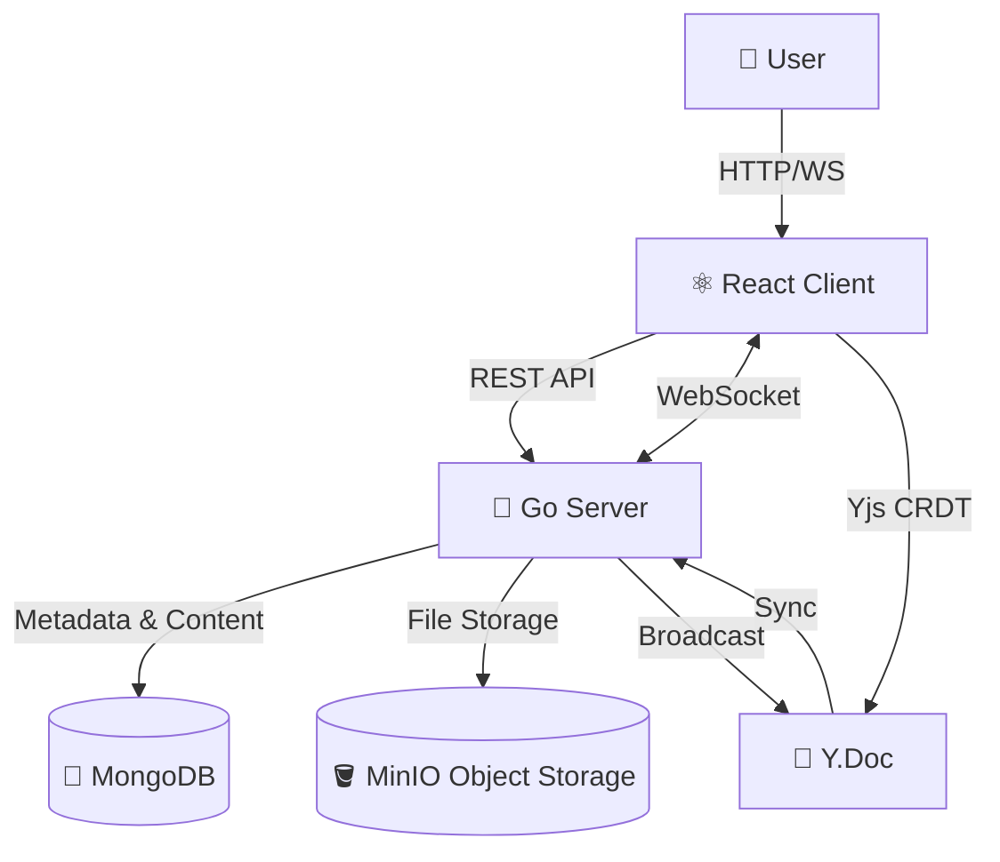

# NoteX 📝✨

**NoteX** is an open and collaborative notes platform designed for everyone 🌍.

With a focus on simplicity and teamwork 🤝, NoteX allows users to write notes 🗒️, track tasks ✅, and collaborate in real time ⚡. The platform encourages idea sharing 💡 and transparent workflows 🔍, making it ideal for personal productivity 👤 as well as team collaboration 👥.

At its core, NoteX stands for **Notes Open To Everyone, eXchange** 🔄 — a space where ideas flow freely 🌊 and work gets done together 🚀.

## 🚀 Why Notex?

We built Notex on the principle of **Zero-Friction Collaboration**.

- **Speed First 🏎️**: Create a room and start typing in seconds. No sign-ups, no onboarding wizard, no nonsense.
- **Human-Friendly URLs 🎯**: Share memorable room links like `notex.pranavdhawale.in/my-project` or `notex.pranavdhawale.in/cosmic-whale`.
- **Real-Time Magic ✨**: See cursors fly and text appear instantly with CRDT-backed concurrency.
- **Ephemeral & Private 🔐**: Rooms auto-expire (24h empty, 7d with content) but you can save snapshots when needed.
- **Mobile-First �**: Designed for seamless use on phones with a dedicated mobile UI and files modal.
- **Engineering Excellence 🛠️**: A simple UI powers a robust, high-performance engine utilizing Go and modern web technologies.

## ✨ Features

### 🎨 Rich Text Editing

- **Full-Featured Editor**: Powered by Tiptap (ProseMirror)
- **Formatting**: Bold, italic, underline, headings, lists, code blocks
- **Tables**: Create and edit tables inline
- **Links**: Add and manage hyperlinks
- **Task Lists**: Interactive checkboxes for to-do items
- **Text Alignment**: Left, center, right, justify

### 🤝 Real-Time Collaboration

- **Live Cursors**: See where others are typing
- **Conflict-Free Editing**: CRDT technology (Yjs) ensures smooth collaboration
- **User Awareness**: See who's in the room
- **Instant Sync**: Changes appear in real-time across all clients

### 🏷️ Smart Room Management

- **Custom Slugs**: Create rooms with memorable names (`my-project`, `team-alpha`)
- **Auto-Generated Names**: Get creative 2-word combinations (`cosmic-whale`, `daring-airedale`)
- **Validation**: 1-2 word slugs, lowercase, alphanumeric + hyphens
- **TTL Management**: Rooms auto-expire based on activity
  - Empty rooms: 24 hours
  - Rooms with content: 7 days

### 📁 File Sharing

- **Upload Files**: Share files within rooms
- **Download Files**: Access uploaded files anytime
- **File Management**: View all files in a room

### ⚡ Performance & Caching

- **Session Persistence**: Content cached in browser for resilience
- **Auto-Recovery**: Recover work after page refresh
- **Compression**: Efficient storage using pako compression
- **Optimized Particles**: High-performance background effects powered by OGL, optimized for low resource usage.

## 🛠️ The Tech Stack

Notex isn't just a toy; it's an architectural showcase.

### **Frontend** (The Beauty) 🎨

- **React 19 + Vite**: Blazing fast builds and HMR
- **TypeScript**: Type-safe development
- **Tiptap**: Headless wrapper for ProseMirror, full editor control
- **Yjs**: CRDT library for conflict-free real-time collaboration
- **OGL**: Ultra-lightweight WebGL library for the particle system
- **Lucide React**: Beautiful icon library

### **Backend** (The Beast) 🦍

- **Go (Golang) 1.23+**: Raw performance and first-class concurrency
- **Gin**: High-performance HTTP web framework
- **WebSocket**: Native Go WebSocket for real-time communication
- **MongoDB**: Stores room metadata, content, and application state
- **MinIO**: S3-compatible object storage for secure, scalable file handling
- **golang-petname**: Human-friendly slug generation

### **Infrastructure** 🏗️

- **Docker & Docker Compose**: Containerized development and deployment
- **Air**: Live reload for Go development
- **Nginx**: Production reverse proxy

## ⚡ Quick Start

Want to see it in action? You only need [Docker](https://www.docker.com/).

```bash
# Clone the repository
git clone https://github.com/pranavdhawale/notex.git
cd notex

# Start development environment 🚀
docker-compose -f docker-compose.dev.yml up --build
```

That's it!

- 🎨 **Frontend**: [http://localhost:5173](http://localhost:5173)
- ⚙️ **Backend**: [http://localhost:8080](http://localhost:8080)
- 🍃 **MongoDB**: `mongodb://localhost:27017`

## 🏗️ Architecture

NoteX follows a **Client-Server** architecture with real-time WebSocket communication.


```mermaid
graph TD
    User[👤 User] -->|HTTP/WS| Client[⚛️ React Client]
    Client -->|REST API| Server[🦍 Go Server]
    Client <-->|WebSocket| Server

    Server -->|Metadata & Content| Mongo[(🍃 MongoDB)]
    Server -->|File Storage| MinIO[(🪣 MinIO Object Storage)]

    Client -->|Yjs CRDT| YjsDoc[📄 Y.Doc]
    YjsDoc -->|Sync| Server
    Server -->|Broadcast| YjsDoc
```

### Key Components

- **Client**: React SPA with Tiptap editor and Yjs integration
- **Server**: Go API server with WebSocket hub, secured by centralized rate limiters and auth middleware
- **MongoDB**: Persistent storage for rooms, content, and metadata
- **MinIO**: S3-compatible service for robust, scalable object & file storage
- **WebSocket Hub**: Manages active connections and broadcasts updates
- **Smart Cache**: Browser-based caching for resilience

## 📁 Project Structure

```
notex/
├── client/                 # React frontend
│   ├── src/
│   │   ├── editor/        # Editor components
│   │   │   ├── Editor.tsx
│   │   │   ├── Toolbar.tsx
│   │   │   ├── FilesSidebar.tsx
│   │   │   └── UsersSidebar.tsx
│   │   ├── components/    # Shared components
│   │   ├── utils/         # Utilities (cache manager)
│   │   └── LandingPage.tsx
│   └── Dockerfile
│
├── server/                # Go backend
│   ├── main.go
│   ├── internal/
│   │   ├── api/          # Protected HTTP handlers
│   │   ├── middleware/   # Security layer (Auth & Rate limits)
│   │   ├── storage/      # MinIO client and file handling
│   │   ├── ws/           # WebSocket hub & clients
│   │   ├── models/       # Data models
│   │   ├── state/        # DB & State connections
│   │   └── utils/        # Utilities
│   └── Dockerfile
│
└── docker-compose.dev.yml
```

## 👩‍💻 Development

We use a modern dockerized workflow with hot-reloading for both backend and frontend.

### Commands

```bash
# Start development environment
docker-compose -f docker-compose.dev.yml up

# Rebuild containers
docker-compose -f docker-compose.dev.yml up --build

# Stop all services
docker-compose -f docker-compose.dev.yml down

# View logs
docker-compose -f docker-compose.dev.yml logs -f

# View specific service logs
docker-compose -f docker-compose.dev.yml logs -f server
docker-compose -f docker-compose.dev.yml logs -f client
```

### Development Features

- **Hot Reload**: Both client (Vite) and server (Air) support live reloading
- **TypeScript**: Full type safety on the frontend
- **Go Modules**: Dependency management with go.mod
- **Docker Volumes**: Code changes reflected immediately

## 🎯 Room Slug Examples

### Auto-Generated (2-word combinations)

- `cosmic-whale`
- `daring-airedale`
- `mighty-frog`
- `perfect-sunbeam`

### Custom Slugs (user-defined)

- `my-project` ✅
- `team-alpha` ✅
- `design-review` ✅
- `hackathon` ✅

### Invalid Slugs

- `My-Project` ❌ (uppercase)
- `my-team-room` ❌ (3 words)
- `a-b` ❌ (too short)
- `my_project` ❌ (underscore)

## 🔒 Privacy & Data

- **No Sign-Up Required**: Start collaborating immediately
- **Ephemeral by Default**: Rooms auto-expire based on activity
- **Secure File Storage**: Files are safely isolated using S3-compatible object storage (MinIO)
- **Built-in Rate Limiting**: Abuse prevention across API & file upload routes
- **No Tracking**: We don't track user behavior
- **Open Source**: Full transparency

## 🤝 Contributing

We ❤️ open source! If you have ideas, suggestions, or bug fixes, feel free to contribute.

1. Fork the repo 🍴
2. Create your feature branch (`git checkout -b feature/AmazingFeature`)
3. Commit your changes (`git commit -m 'Add some AmazingFeature'`)
4. Push to the branch (`git push origin feature/AmazingFeature`)
5. Open a Pull Request 📩

## 📝 License

This project is licensed under the MIT License - see the [LICENSE](LICENSE) file for details.

---

**Built with ❤️ for the community.**
