# NoteX 📝✨

**NoteX** is an open and collaborative notes and tasks platform designed for everyone 🌍.

With a focus on simplicity and teamwork 🤝, NoteX allows users to write notes 🗒️, track tasks ✅, and collaborate in real time ⚡. The platform encourages idea sharing 💡 and transparent workflows 🔍, making it ideal for personal productivity 👤 as well as team collaboration 👥.

At its core, NoteX stands for **Notes Open To Everyone, eXchange** 🔄 — a space where ideas flow freely 🌊 and work gets done together 🚀.


## 🚀 Why Notex?

We built Notex on the principle of **Zero-Friction Collaboration**.

- **Speed First 🏎️**: Create a room and start typing in seconds. No sign-ups, no onboarding wizard, no nonsense.
- **Real-Time Magic ✨**: See cursors fly and text appear instantly with CRDT-backed concurrency.
- **Ephemeral & Private 🔐**: Data exists while it's useful. Rooms are ephemeral by default, but you can save snapshots when you need them.
- **Engineering Excellence 🛠️**: A simple UI powers a robust, high-performance engine utilizing Go and Rust strategies for maximum efficiency.

## 🛠️ The Tech Stack

Notex isn't just a toy; it's an architectural showcase.

### **Frontend** (The Beauty) 🎨
- **React 18 + Vite**: Blazing fast builds and specific HMR.
- **TipTap**: A headless wrapper for ProseMirror, giving us full control over the editor.
- **Yjs**: The conflict-free replicated data type (CRDT) library that makes real-time collaboration possible without conflicts.
- **Zustand**: Lightweight state management for UI and connection status.

### **Backend** (The Beast) 🦍
- **Go (Golang)**: Chosen for its raw performance and first-class concurrency primitives.
- **Gin**: A high-performance HTTP web framework.
- **Gorilla WebSocket**: For managing the real-time event loop.
- **MongoDB**: Stores room metadata and ownership details.
- **Redis**: Handles ephemeral state, presence, and pub/sub for scaling.

## ⚡ Quick Start

Want to see it in action? You only need [Docker](https://www.docker.com/).

```bash
# Clone the repository
git clone https://github.com/pranavdhawale/notex.git
cd notex

# Ignite the engines 🚀
docker-compose up --build
```

That's it! 
- 🎨 **Frontend**: [http://localhost:5173](http://localhost:5173)
- ⚙️ **Backend**: [http://localhost:8080](http://localhost:8080)

## 🏗️ Architecture

NoteX follows a **Monolithic Service** architecture (v1) designed for logical separation and future extraction.

```mermaid
graph TD
    User[👤 User] -->|HTTP/WS| Nginx[🌐 Nginx/Proxy]
    Nginx -->|Static Assets| Client[⚛️ React Client]
    Nginx -->|API & WS| Server[🌭 Go Server]
    
    Client -- CRDT Updates --> Server
    Server -- Broadcast --> Client
    
    Server -->|Metadata| Mongo[🍃 MongoDB]
    Server -->|Presence| Redis[🔺 Redis]
    Server -->|Uploads| FS[📂 Local Filesystem]
```



## 👩‍💻 Development

We use a modern dockerized workflow with hot-reloading for both backend and frontend.


### Commands used often
- **Start Project**: `docker-compose up`
- **Rebuild Containers**: `docker-compose up --build`
- **Stop Project**: `docker-compose down`
- **View Logs**: `docker-compose logs -f`

## 🤝 Contributing

We ❤️ open source! If you have ideas, suggestions, or bug fixes, feel free to contribute.

1. Fork the repo 🍴
2. Create your feature branch (`git checkout -b feature/AmazingFeature`)
3. Commit your changes (`git commit -m 'Add some AmazingFeature'`)
4. Push to the branch (`git push origin feature/AmazingFeature`)
5. Open a Pull Request 📩

---

**Built with ❤️ for the community.**
*Star us on GitHub if you like what you see!* 🌟
